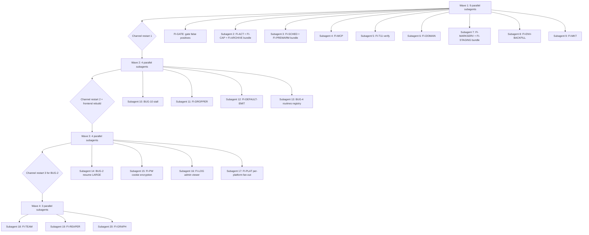

# PLAN — PARALLEL: subagent-driven execution roadmap

*Author: soma-improver (opus). Date: 2026-05-31. Source: dependency analysis over `BUGS_PLAN.md` + today's new follow-ups.*

---

## TL;DR

- **Wave 1 (Round N): 9 parallel subagents** — all small-effort items + a handful of bundled-S clusters. One channel restart at the end of the wave activates 6 of the 9. No DNS / no new cert / no architectural risk.
- **Wave 2 (Round N+1): 4 parallel subagents** — depend on Wave 1's channel restart being in flight + the FI-PREWARM cache landing. The lead-default-emit + admin file dropper + channel-stall root fix all ship here.
- **Wave 3 (Round N+2): 4 parallel subagents** — `BUG-2` killed-lead resume is the dedicated L item; everything else (`FI-PW`, `FI-LOG`, `FI-PLAT`) runs alongside it independently.
- **Wave 4 (Round N+3): 3 subagents** unblock once `BUG-2` ships — team-roster persistence, reaper-resume integration, graph teammate handles.
- **Backlog**: `SEC-1` (bundle with any restart). **Blocked**: `GROK` (user decision).

Throughput: **20 parallel subagents** vs the strictly-sequential sequencing in `BUGS_PLAN.md`. The Round N maintenance window collapses from "one bundle" to "one restart event that closes 6 items".

---

## Standing policy (re-confirmed; binding)

- **You (the human operator) review + approve each wave before it fires.** This plan is a roadmap, not autonomous execution.
- **The lead (soma-improver) stays opus + `--effort max`** for planning, review, and dispatch.
- **Every implementation subagent dispatched from this plan must be `model=sonnet`, `--effort max`, and MUST invoke `mcp__sequential-thinking__sequentialthinking` at least 3 times** (plan + design + pre-commit review). Non-negotiable. Sequential-thinking compensates for sonnet's smaller reasoning surface.
- **Sole git author**: `Mayank Gupta <techfreakworm@gmail.com>`. No `Co-Authored-By`, no Claude footer, no emoji. Conventional commit subjects.
- **No new Python deps** without an explicit ask + justification.
- **Notify discipline**: each impl subagent should fire `STARTED` when they pick up the task, `MILESTONE` per commit, `COMPLETED` with deliverable paths when they finish, `ERROR` if blocked. This convention is itself a queue item (`FI-DEFAULT-EMIT` in Wave 2) — until that lands, the lead manually fires these on the impl subagent's behalf via the `EventStore.insert_event` + `POST /notify` bypass path (the same path the lead has been using today).

---

## Inventory snapshot (28 items)

Already shipped today (pruned from the planning queue):

| Shipped | Commit | Status |
|---|---|---|
| FI-NOTIFY (lead → orchestrator notify channel) | `c348675` + `05f97a7` + `1502e93` | activated via channel restart 11:14 IST 2026-05-31 |
| FI-CADDY (Caddy-via-own-domain file relay) | `e776d45` | activated via `caddy reload` 17:08 UTC 2026-05-31 |
| FI-LEAD-CONTINUE (spawn template + backfill) | `d5a24c8` | shipped; backfill not yet run by operator |
| `kill_project` post-kill verify | `c99c743` | shipped + activated |
| Reaper tmux-liveness | `53f7113` | shipped + activated |
| Orchestrator gates v1 | `9b26c72` | shipped + activated |
| `send_tg_reply` (GFM → HTML) | `7387bd0` | shipped + activated |
| Default-notify-emission convention (FUTURE entry only — impl pending) | `8650399` | doc-only; impl tracked as **FI-DEFAULT-EMIT** below |
| FI-DOMAIN (HARD shipped — relay live) | `e776d45` subsumes; domain hard-coded in fragment | partial — see *Wave 1 §6* for remaining cleanup |

Still open (sorted by Wave assignment):

| Wave | ID | Title | Severity | Leverage | Effort | Restart? |
|---|---|---|---|---|---|---|
| 1 | **FI-GATE** | Orchestrator gate false positives | P1 | 4 | S | no |
| 1 | **FI-ACT** | `last_activity` column bumped on tmux send-keys | P2 | 4 | S | channel |
| 1 | **FI-CAP** | Concurrency-cap intersect with `is_lead_alive` | P2 | 2 | S | channel |
| 1 | **FI-ARCHIVE** | `kill_project` archive log "nothing to archive" | P3 | 2 | S | channel |
| 1 | **FI-SCHED** | Codify schedule-routine bash-fallback as tool | P2 | 2 | S | channel |
| 1 | **FI-PREWARM** | Routines cache prewarm | P2 | 2 | S | channel |
| 1 | **FI-MCP** | `.mcp.json` env vs `secrets.env` SoT | P2 | 3 | S | channel |
| 1 | **FI-T11** | T11 usage-snapshot verify-close | P2 | 1 | S | no |
| 1 | **FI-DOMAIN** | Hard-coded domain cleanup (CORS + render_caddyfile + secrets.env knob) | P2 | 3 | S | api |
| 1 | **FI-MKT** | `marketplace.json` publish test | P3 | 1 | S | no |
| 1 | **FI-MARKSERV-UNIT** *(new)* | `claude-soma-markserv.service` for reboot survival | P2 | 3 | S | enable |
| 1 | **FI-STAGING** *(new)* | Move `/tmp/social-engagement/` → `/var/lib/claude-soma/staging/` | P2 | 3 | S | enable |
| 1 | **FI-ENV-BACKFILL** *(new)* | Backfill `HERMES_LEAD_NAME` + `HERMES_NOTIFY_ENDPOINT` into existing transient units | P1 | 5 | S | per-lead |
| 1 (verify) | **BUG-7** | Subagent vector verify (poller hijack residual) | P1 | 4 | S | channel |
| 1 (verify) | **BUG-9** | T1-T5 verify-close | P2 | 3 | S | channel done |
| 2 | **FI-DEFAULT-EMIT** *(new, scored)* | Bake notify-emission convention into lead spawn brief | P1 | 5 | S | channel |
| 2 | **BUG-10** | Channel stall on large attachment (investigation + fix) | P1 | 3 | M | channel |
| 2 | **FI-DROPPER** | Admin file dropper for >20 MB uploads | P1 | 2 | M | frontend + api |
| 2 | **BUG-4** | Routines registry never populated (`register_routine` at 3 sites) | P2 | 2 | M | channel |
| 2 | **FI-PUBLISH-CLI** *(new)* | `soma-publish` thin wrapper / canonical alias | P3 | 2 | S | none |
| 3 | **BUG-2** | Killed-lead resume (`--session-id`/`--resume`) | P1 | 2 | L | channel |
| 3 | **FI-PW** | Playwright cookie store encryption | P2 | 2 | M | none |
| 3 | **FI-LOG** | Per-lead log viewer in admin | P3 | 2 | M | frontend + api |
| 3 | **FI-PLAT** | More social platforms (Bluesky, Mastodon, Threads) | P3 | 2 | M | none |
| 4 | **FI-TEAM** | Team-roster persistence (← BUG-2) | P2 | 2 | M | channel |
| 4 | **FI-REAPER** | Reaper ↔ resume integration (← BUG-2) | P2 | 2 | M | channel |
| 4 | **FI-GRAPH** | Exact teammate handles in graph | P3 | 2 | M | channel |
| backlog | **SEC-1** | Rotate leaked Telegram token | P3 | 1 | S | channel |
| blocked | **GROK** | Grok Build integration (image + video) | — | — | S/M | none |

---

## Dependency DAG

```
                                  ┌──── BUG-2 (killed-lead resume, L) ────┐
                                  │                                       │
                                  │            ┌── FI-TEAM ───────┐       │
                                  │            ├── FI-REAPER ─────┤       │
                                  │            └── FI-GRAPH ──────┘       │
                                  │                                       │
   ┌─ FI-PREWARM ──→ BUG-4 ────────────────────────────────────────────────┘
   ├─ FI-CAP ───────┐
   ├─ FI-ARCHIVE ──→├─→ (server.py + spawner.py bundle: SUBAGENT 2)
   ├─ FI-ACT ──────┘
   │
   ├─ FI-SCHED ────┐
   ├─ FI-PREWARM ─→├─→ (hermes_api/server.py bundle: SUBAGENT 3)
   │
   ├─ FI-MCP ──────→ (.mcp.json: SUBAGENT 4)
   ├─ FI-T11 ──────→ (CHECKLIST.md: SUBAGENT 5)
   ├─ FI-DOMAIN ───→ (api/main.py + wizard/init.py: SUBAGENT 6)
   ├─ FI-MARKSERV ─┐
   ├─ FI-STAGING ─→├─→ (systemd unit + staging dir: SUBAGENT 7)
   ├─ FI-ENV-BACKFILL → (backfill script: SUBAGENT 8)
   ├─ FI-MKT ──────→ (marketplace test: SUBAGENT 9)
   ├─ FI-GATE ─────→ (orchestrator_gate.sh: SUBAGENT 1)
   │
   ├─ BUG-7 (verify) ──→ ride-along channel restart
   ├─ BUG-9 (verify) ──→ ride-along channel restart
   │
   ↓  WAVE 1 channel restart
   │
   ├─ FI-DEFAULT-EMIT ─→ (server.py spawn_project_impl: SUBAGENT 12)
   ├─ BUG-10 ───────────→ investigate first → fix (SUBAGENT 10)
   ├─ FI-DROPPER ───────→ frontend admin route + api (SUBAGENT 11)
   ├─ BUG-4 ────────────→ register_routine wired (SUBAGENT 13, depends on FI-PREWARM)
   ├─ FI-PUBLISH-CLI ───→ canonical alias (SUBAGENT — riser; can pair with any small wave)
   │
   ↓  WAVE 2 channel restart + frontend rebuild
   │
   ├─ BUG-2 (LARGE) ────→ spawner.py + registry.py (SUBAGENT 14)
   ├─ FI-PW ────────────→ pw-refresh.js + pw-login.js (SUBAGENT 15)
   ├─ FI-LOG ───────────→ admin route + api (SUBAGENT 16)
   ├─ FI-PLAT ──────────→ per-platform agents (SUBAGENT 17, one per platform)
   │
   ↓  WAVE 3 channel restart (for BUG-2)
   │
   ├─ FI-TEAM ──────────→ team registry table (SUBAGENT 18, ← BUG-2)
   ├─ FI-REAPER ────────→ reaper resume integration (SUBAGENT 19, ← BUG-2)
   └─ FI-GRAPH ─────────→ teammate handles (SUBAGENT 20, independent but low priority)
```

### Mermaid form (renders on GitHub + Caddy markdown viewers)



---

## Wave 1 — Round N (9 parallel subagents)

All subagents in this wave can fire **simultaneously** with no inter-dependencies. Coordination points are listed below the per-subagent briefs.

### Subagent 1 — FI-GATE (orchestrator gate false positives)

```
## Standing model split
model=sonnet, --effort max, MUST call mcp__sequential-thinking__sequentialthinking at least 3 times.

## Task
Tighten the orchestrator PreToolUse gate at `scripts/orchestrator_gate.sh` to eliminate the two false-positive patterns observed since `9b26c72`:
(a) Bash heredoc whose body *describes* network tools was flagged. Fix: parse the FIRST non-pipeline token of the Bash command, not `grep -qE` over the full command string.
(b) `Write` calls to `/tmp` were denied. Fix: scope the Write deny to production paths only (`/opt/claude-soma/`, `/etc/`, `/var/lib/`); allow `/tmp/*` scratch writes.

## cwd
/home/ubuntu/projects/soma-improver/claude-soma

## Files
- scripts/orchestrator_gate.sh (edit)
- tests/test_orchestrator_gate.py (extend; matches existing 120-case style)

## Tests to add (at minimum)
- Bash heredoc containing "apt install" inside a quoted string body is ALLOWED
- Bash starting with "apt install" (no quoting) is DENIED
- Write to /tmp/foo.txt is ALLOWED
- Write to /opt/claude-soma/anything is DENIED
- Write to /etc/anything is DENIED

## Restart
NONE — the gate script is exec'd fresh per PreToolUse event.

## Convention
- Git author Mayank Gupta <techfreakworm@gmail.com>, sole author
- Conventional commit subject: `fix(gate): tighten heredoc + Write production-path heuristics`
- Push to origin/main

## DO NOT
- Touch any code OUTSIDE scripts/orchestrator_gate.sh + tests/test_orchestrator_gate.py
- Add Python deps
- Restart any service
```

### Subagent 2 — FI-ACT + FI-CAP + FI-ARCHIVE (bundled — `server.py` + `spawner.py`)

```
## Standing model split
model=sonnet, --effort max, MUST call sequential-thinking at least 3 times.

## Task
Three related project-orchestrator improvements bundled into one commit to avoid merge conflicts on shared files:

1. **FI-ACT**: bump `last_activity` on the raw `tmux send-keys` path. The bot talks to leads via raw send-keys (per responsive_bot.md "Messaging a project-lead"), bypassing `send_to_project_impl`'s `_reg().touch(name)`. Validated 2026-05-29: `t1-spawn-test`'s last_activity stayed at spawn timestamp despite a delivered + answered message. Fix: when a lead is messaged via send-keys, the orchestrator should touch the registry. Approach: expose an `mcp__project_orchestrator__touch_project(name)` tool that the bot calls right after every send-keys to a lead. Update `responsive_bot.md` to instruct the bot to call it. (Alternative: a UserPromptSubmit hook that scans recent activity log for tmux send-keys events — heavier, less reliable.)

2. **FI-CAP**: in `spawner.py::spawn_background_lead` (or wherever the cap is enforced — find it), intersect the count of `status='active'` registry rows with `is_lead_alive(name)` before checking against `HERMES_MAX_CONCURRENT_PROJECTS`. Belt-and-suspenders against stale registry rows after a crash.

3. **FI-ARCHIVE**: in `kill_project_impl` at `server.py`, when the `archive=True` branch encounters a lead with no `.claude/` memory dir, log "nothing to archive for {name}" instead of silently returning None.

## cwd
/home/ubuntu/projects/soma-improver/claude-soma

## Files
- src/claude_soma/mcp_servers/project_orchestrator/server.py (FI-ACT new tool + FI-ARCHIVE log)
- src/claude_soma/mcp_servers/project_orchestrator/spawner.py (FI-CAP intersect)
- system_prompts/responsive_bot.md (FI-ACT instruction)
- tests/mcp_servers/test_project_orchestrator.py + test_orchestrator_spawner.py (extend)

## Restart
channel-claude.service (after Wave 1) — picks up new MCP tool + spawner change + system prompt.

## Convention
- Commit subject: `feat(orchestrator): bump last_activity on tmux send-keys + cap intersect liveness + archive log`
- Push to origin/main

## DO NOT
- Touch unrelated server.py / spawner.py paths
- Add Python deps
- Restart any service
```

### Subagent 3 — FI-SCHED + FI-PREWARM (bundled — `hermes_api/server.py`)

```
## Standing model split
model=sonnet, --effort max, sequential-thinking ≥3.

## Task
Two related hermes_api improvements bundled into one commit:

1. **FI-SCHED**: codify the working one-shot Telegram reminder pattern (`nohup setsid bash` + `sleep` + `~/.claude/channels/telegram/.env` + Bot-API `sendMessage`) as a new MCP tool `mcp__hermes_api__schedule_reminder(when, message)`. The tool spawns the background bash process, returns the PID. RemoteTrigger v2 is stale (HTTP 400) per repo memory. Tribal-knowledge fix.

2. **FI-PREWARM**: the routines cache built in `9a76a75` pays ~12s for the first request per TTL. Extend `scripts/claude-soma-cache-refresh.timer` invocation OR add an MCP server side-effect to prewarm the cache so no user request waits for a cold cache.

## cwd
/home/ubuntu/projects/soma-improver/claude-soma

## Files
- src/claude_soma/mcp_servers/hermes_api/server.py (add schedule_reminder tool + prewarm helper)
- systemd/claude-soma-cache-refresh.timer (extend if scheduled prewarm)
- skills/schedule-routine/SKILL.md (update to reference the new tool)
- tests/mcp_servers/test_hermes_api.py (extend)

## Restart
channel-claude.service (Wave 1) for new MCP tool registration.

## Convention
- Commit subject: `feat(hermes-api): schedule_reminder tool + routines cache prewarm`

## DO NOT
- Touch the FI-NOTIFY notify_store or send_tg_reply paths
- Add deps (use stdlib for the bash spawn; subprocess pattern)
```

### Subagent 4 — FI-MCP (`.mcp.json` source-of-truth)

```
## Standing model split
sonnet + max + seq-thinking ≥3.

## Task
Drop `HERMES_MAX_CONCURRENT_PROJECTS` (and any other `secrets.env`-overlapping tunable) from `.mcp.json`'s `env` block. The MCP server's `int(os.environ.get(..., "6"))` default takes over for fresh installs; operators set overrides only in `/etc/claude-soma/secrets.env`. This prevents the silent override that cost a debugging cycle on 2026-05-30.

## cwd
/home/ubuntu/projects/soma-improver/claude-soma

## Files
- .mcp.json (drop the line)
- docs/CHECKLIST.md or NEXT.md (note the change so future operators know the override path)

## Restart
channel-claude.service (Wave 1).

## Convention
- Commit subject: `fix(mcp): drop HERMES_MAX_CONCURRENT_PROJECTS from .mcp.json — secrets.env is the single source of truth`

## DO NOT
- Change other env values in .mcp.json
```

### Subagent 5 — FI-T11 (T11 verify-close, doc-only)

```
## Standing model split
sonnet + max + seq-thinking ≥3.

## Task
Verify the usage-snapshot job (T11) runs cleanly and update `docs/CHECKLIST.md` to mark it done. Doc-only; no code.

## cwd
/home/ubuntu/projects/soma-improver/claude-soma

## Steps
1. Inspect `systemd/claude-soma-usage-snapshot.timer` next-fire + recent journal
2. Confirm `/opt/claude-soma/usage.sqlite` has rows from the last 24h
3. Update docs/CHECKLIST.md T11 row to ✓ with the evidence

## Restart
NONE.

## Convention
- Commit subject: `docs(checklist): T11 usage-snapshot verified — close`
```

### Subagent 6 — FI-DOMAIN (hard-coded domain cleanup)

```
## Standing model split
sonnet + max + seq-thinking ≥3.

## Task
Centralize domain strings on `SOMA_DOMAIN` (or `SOMA_RELAY_DOMAIN` for the relay) in `/etc/claude-soma/secrets.env`. Update:
1. `api/main.py` line 13 (CORS origin list) — read from env
2. `wizard/init.py::render_caddyfile()` — read from env
3. `caddy/files.caddyfile.in` — already uses `files.mayankgupta.in` hard-coded; either keep (FI-CADDY already shipped) OR template via `${SOMA_RELAY_DOMAIN}` if the wizard renders it
4. `secrets.env.template` (if exists) — document the new knobs

## cwd
/home/ubuntu/projects/soma-improver/claude-soma

## Files
- src/claude_soma/api/main.py (line 13)
- src/claude_soma/wizard/init.py (render_caddyfile)
- caddy/files.caddyfile.in (optional templating)
- docs/CHECKLIST.md (note)
- tests/test_api_cors.py (new — verify CORS reads from env)

## Restart
claude-soma-api.service (after this ships).

## Convention
- Commit subject: `refactor(domain): centralize SOMA_DOMAIN in secrets.env`

## DO NOT
- Touch the live /etc/caddy/Caddyfile (out of scope)
- Modify the running CORS by editing the env var directly — the API restart picks it up
```

### Subagent 7 — FI-MARKSERV-UNIT + FI-STAGING (bundled — paired by path)

```
## Standing model split
sonnet + max + seq-thinking ≥3.

## Task
Two paired items: move the markdown-render bundle out of volatile `/tmp/` AND make it a first-class systemd unit so it survives reboot.

1. **FI-STAGING**: create `/var/lib/claude-soma/staging/` (ubuntu:ubuntu, mode 0755) as the new home for markserv-served documents (the ngrok bundle's BUGS_PLAN, PLAN-*, demo scripts). Migration helper script (`scripts/migrate-staging.sh`) moves existing `/tmp/social-engagement/*` to `/var/lib/claude-soma/staging/` on first run. Idempotent.

2. **FI-MARKSERV-UNIT**: new `systemd/claude-soma-markserv.{service,timer}` pair — Type=simple service that runs `markserv /var/lib/claude-soma/staging/ --port 18080 --address 127.0.0.1` (locally bound; the existing or future ngrok tunnel forwards). `Restart=on-failure`. Enable on boot. Optional timer NOT needed — service is long-running.

## cwd
/home/ubuntu/projects/soma-improver/claude-soma

## Files
- systemd/claude-soma-markserv.service (new)
- scripts/markserv-launch.sh (new, executable — wraps `markserv` invocation with the env we want)
- scripts/migrate-staging.sh (new, executable, idempotent)
- scripts/vps_bootstrap.sh (add step to create /var/lib/claude-soma/staging + install the unit)
- src/claude_soma/install.py + src/claude_soma/wizard/init.py (register new service in the install plan, mirror the RC-URL refresh pattern)
- system_prompts/responsive_bot.md (one-line update — the markserv bundle now lives at /var/lib/claude-soma/staging/, not /tmp)
- tests/scripts/test_migrate_staging.py (new — idempotency + permissions)

## Restart
Enable + start `claude-soma-markserv.service`. NO other restart.

## Convention
- Commit subject: `feat(routines): claude-soma-markserv service + /var/lib/claude-soma/staging migration`

## DO NOT
- Touch the existing /tmp/social-engagement files during the impl (the migration helper handles them at deploy time)
- Modify the ngrok tunnel itself (the user's tunnel runs separately; this just ensures markserv survives reboot)
```

### Subagent 8 — FI-ENV-BACKFILL

```
## Standing model split
sonnet + max + seq-thinking ≥3.

## Task
Extend `scripts/lead_continue_backfill.sh` (shipped in d5a24c8) — OR add a sibling `scripts/lead_env_backfill.sh` — to ALSO inject `Environment="HERMES_LEAD_NAME=<name>"` and `Environment="HERMES_NOTIFY_ENDPOINT=http://127.0.0.1:9100"` lines into the `[Service]` block of each `/run/systemd/transient/claude-soma-lead-*.service`. Idempotent. Same `LEAD_CONTINUE_BACKFILL_NOSUDO` + `LEAD_CONTINUE_BACKFILL_DIR` test-isolation pattern.

WHY: existing pre-c348675 leads cannot call `mcp__hermes-notify__notify_orchestrator` because the env vars are absent (confirmed today on the soma-improver lead — the user manually bypassed via direct POST to the listener). After this backfill + a per-lead `systemctl restart`, leads regain notify capability.

## cwd
/home/ubuntu/projects/soma-improver/claude-soma

## Files
- scripts/lead_continue_backfill.sh (extend — adds Environment= lines if missing)
- tests/scripts/test_lead_continue_backfill.py (extend — verify env injection path)

## Restart
Per-lead restart by operator after backfill runs (same workflow as FI-LEAD-CONTINUE).

## Convention
- Commit subject: `fix(spawner): backfill HERMES_LEAD_NAME + HERMES_NOTIFY_ENDPOINT into existing transient units`

## DO NOT
- Restart any lead unit yourself
- Break the existing FI-LEAD-CONTINUE backfill behavior (test that --continue still gets inserted)
```

### Subagent 9 — FI-MKT (marketplace publish test)

```
## Standing model split
sonnet + max + seq-thinking ≥3.

## Task
End-to-end verify that `/plugin marketplace add techfreakworm/claude-soma` works. Add a test script (or docs/CHECKLIST.md verification) confirming the marketplace.json metadata is well-formed and the install path completes against a fresh test environment.

## cwd
/home/ubuntu/projects/soma-improver/claude-soma

## Files
- marketplace.json (validate)
- tests/test_marketplace.py (new — schema + parse test)
- docs/CHECKLIST.md (mark V1.5 marketplace publish ✓)

## Restart
NONE.

## Convention
- Commit subject: `test(marketplace): publish path verified end-to-end`
```

### Wave 1 — verify-only riders (no implementation; ride the channel restart)

**BUG-7** (subagent vector verify): after the Wave 1 channel restart, dispatch one trivial background Agent + watch `~30 s` for a second `bun server.ts` process or a changed `bot.pid`. If a second bun appears, route heavy work via leads (already done in practice). The empirical 35-second window from 2026-05-29 covered the leads→subagent path; this confirms the channel→subagent path.

**BUG-9** (T1-T5 verify-close): T1-T5 was substantially exercised on 2026-05-29 against the new code (commits `c99c743`, `53f7113`, `9b26c72`). The remaining work is updating `docs/CHECKLIST.md` to reflect the green run. Subagent 5 (FI-T11) can sweep this same `docs/CHECKLIST.md` update in the same commit if scheduling allows.

---

## Wave 2 — Round N+1 (4 parallel subagents)

Fires after Wave 1's channel restart. The bot is on the new code; existing leads (post-FI-ENV-BACKFILL + per-lead restart) can fire notify events; the routines cache is warm.

### Subagent 10 — BUG-10 (channel stall on large attachment)

```
## Standing model split
sonnet + max + seq-thinking ≥3.

## Task
Two-step:
1. **INVESTIGATE FIRST**. Read `/var/log/claude-soma/channel.log` around 21:38-21:40 UTC 2026-05-29 (the 235 MB pptx incident). Confirm which of the four hypotheses (a-d in KNOWN_BUGS #10) is responsible. Write findings to /tmp/BUG-10-investigation.md. Pause for review.
2. **FIX**. Most likely: short-circuit `getFile` when `message.document.file_size > 20 * 1024 * 1024` BEFORE the API round-trip. Surface a clear error to the user ("file too big — use soma-relay or the admin file dropper"). Fix lives in a wrapper or guidance in responsive_bot.md (the third-party plugin code is untouchable cleanly).

## cwd
/home/ubuntu/projects/soma-improver/claude-soma

## Files
- /tmp/BUG-10-investigation.md (first; not committed)
- system_prompts/responsive_bot.md (likely edit point — instruct the bot to check file_size before download_attachment)
- (Possibly) src/claude_soma/mcp_servers/hermes_api/server.py (if a check-before-download MCP wrapper is the cleaner path)
- tests as needed

## Restart
channel-claude.service.

## Convention
- Commit subject: `fix(channel): short-circuit getFile when document size > 20 MB cap`

## STOP-AND-SURFACE
If investigation surfaces a hypothesis (c) retry loop OR (d) inbound poller starvation, write the findings to /tmp/BUG-10-INVESTIGATION.md and PAUSE — those need user input on whether to patch the plugin or wait for upstream.
```

### Subagent 11 — FI-DROPPER (admin file dropper)

```
## Standing model split
sonnet + max + seq-thinking ≥3.

## Task
Add a drag-drop file upload zone to the admin per-lead page. Files >20 MB upload via multipart streaming (no OOM on 200+ MB). Files land at `/var/lib/claude-soma/staging/<lead-name>/inbox/` (or `/var/lib/claude-soma/relay/<lead-name>/inbox/` — verify which directory the bot reads from). A manifest file (`name + size + sha256 + uploaded_at`) is written alongside each upload. Auth-gated via the existing GitHub OAuth handle.

OPTIONAL bonus: a follow-up DM to the user via the FI-NOTIFY listener when the file lands ("file uploaded for <lead-name>, brief me").

## cwd
/home/ubuntu/projects/soma-improver/claude-soma

## Files
- frontend/app/admin/<lead-name>/upload/* (new route + drop-zone component)
- src/claude_soma/api/routes/admin_upload.py (new — multipart streaming endpoint, auth gate, manifest writer)
- tests/api/test_admin_upload.py (new)
- system_prompts/responsive_bot.md (small section: "Files dropped via admin land at <path>; you can see them via mcp__project_orchestrator__list_inbox or similar")

## Restart
frontend rebuild + claude-soma-api.service restart.

## Convention
- Commit subject: `feat(admin): file dropper for large uploads with multipart streaming + manifest`

## DO NOT
- Skip the auth gate (every upload must pass require_authed_user)
- OOM on 200 MB files (use streaming uploads end-to-end)
```

### Subagent 12 — FI-DEFAULT-EMIT

```
## Standing model split
sonnet + max + seq-thinking ≥3.

## Task
Bake the FI-NOTIFY emission convention into every lead spawn brief by default. Per the FUTURE_IMPROVEMENTS entry (commit 8650399), the recommended fix path is OPTION (b): in `src/claude_soma/mcp_servers/project_orchestrator/server.py::spawn_project_impl`, prepend a "Standing notify convention" block to the brief BEFORE passing it to `spawn_background_lead`. The convention block instructs the lead to:

- Fire STARTED when a major task begins
- Fire MILESTONE on each commit + major sub-task complete (throttled server-side to 5 min/lead)
- Fire COMPLETED with paths/URLs when the task wraps
- Fire NEEDS_INPUT when blocked on the user
- Fire ERROR on hard failures (recoverable bool)

Single-site code change. Survives lead restarts because the convention lands in transcript on first spawn and is replayed via `--continue`.

## cwd
/home/ubuntu/projects/soma-improver/claude-soma

## Files
- src/claude_soma/mcp_servers/project_orchestrator/server.py (spawn_project_impl — prepend convention)
- system_prompts/lead_notify_convention.md (new — the literal text block prepended)
- tests/mcp_servers/test_project_orchestrator.py (extend — verify prepended brief shape)

## Restart
channel-claude.service (Wave 2) so the new spawn flow is loaded. Existing leads keep their old briefs (they'll get the convention on next FRESH spawn — not on --continue resume).

## Convention
- Commit subject: `feat(orchestrator): prepend notify-emission convention to every lead spawn brief`

## DO NOT
- Edit spawner.py (the convention lives ABOVE the spawner, in server.py's brief construction)
- Edit responsive_bot.md (that's the channel's prompt, not the lead's)
- Touch existing leads' briefs
```

### Subagent 13 — BUG-4 (routines registry never populated)

```
## Standing model split
sonnet + max + seq-thinking ≥3.

## Task
Wire `register_routine()` at the three call sites where routines are created:
1. The `schedule-routine` skill (after creating a cloud RemoteTrigger)
2. Bot-created local timers (in the FI-SCHED tool from Subagent 3 — coordinate)
3. The wizard's default timers (in `wizard/init.py`)

Store `metadata.unit` at the same time so the merger stops relying on heuristic name aliasing.

DEPENDS ON: FI-PREWARM from Subagent 3 — the routines query layer should already be fast by the time this lands.

## cwd
/home/ubuntu/projects/soma-improver/claude-soma

## Files
- skills/schedule-routine/SKILL.md (or its impl)
- src/claude_soma/mcp_servers/hermes_api/server.py (extend FI-SCHED tool to also register)
- src/claude_soma/wizard/init.py (call register_routine on default-timer setup)
- src/claude_soma/mcp_servers/project_orchestrator/registry.py (add register_routine if not yet present)
- tests/...

## Restart
channel-claude.service.

## Convention
- Commit subject: `fix(routines): wire register_routine at 3 call sites + metadata.unit`
```

### Subagent — FI-PUBLISH-CLI (small, low-priority — runs anytime)

```
## Standing model split
sonnet + max + seq-thinking ≥2 (this is a thin wrapper; less analysis needed).

## Task
Decide: rename `scripts/soma-relay` to `scripts/soma-publish` OR ship `scripts/soma-publish` as an alias that exec's soma-relay. The user's intent is a clean, discoverable CLI for the common "publish a file to the relay" case.

Recommendation: alias (`soma-publish` → calls `soma-relay publish "$@"`). One-line bash. The `soma-relay` name stays for ops who know the full surface (rm/list).

## cwd
/home/ubuntu/projects/soma-improver/claude-soma

## Files
- scripts/soma-publish (new, executable, 5-line alias)
- system_prompts/responsive_bot.md (mention `soma-publish` as the friendlier name)

## Restart
NONE.

## Convention
- Commit subject: `chore(relay): soma-publish friendly alias for soma-relay publish`
```

---

## Wave 3 — Round N+2 (4 parallel subagents)

### Subagent 14 — BUG-2 (killed-lead resume) — L effort dedicated

```
## Standing model split
sonnet + max + seq-thinking ≥5 (this is L effort and high risk — extra reasoning required).

## Task
Implement killed-lead resume:
1. At first spawn, generate a UUID and pass `--session-id <uuid>` to claude
2. Persist `name → uuid` in the registry (new column or sidecar table)
3. On respawn (after kill / OOM / crash), build the argv with `--resume <uuid>` instead of `--continue`
4. For v1: teams are EPHEMERAL. The resumed lead re-plans from its own transcript. (Full team-roster persistence is FI-TEAM in Wave 4.)

## cwd
/home/ubuntu/projects/soma-improver/claude-soma

## Files
- src/claude_soma/mcp_servers/project_orchestrator/spawner.py (large)
- src/claude_soma/mcp_servers/project_orchestrator/registry.py (uuid column)
- src/claude_soma/mcp_servers/project_orchestrator/server.py (spawn_project_impl)
- scripts/reaper.py (resume integration — coordinate with FI-REAPER in Wave 4)
- tests/...

## Restart
channel-claude.service (Wave 3) for spawner code.

## Convention
- Commit subject: `feat(spawner): killed-lead resume via --session-id / --resume`

## STOP-AND-SURFACE
- Schema migration on registry.sqlite — confirm BACKWARD-COMPAT before shipping
- claude --session-id behavior with EXISTING transcripts (does it conflict with --continue?)
```

### Subagent 15 — FI-PW (Playwright cookie encryption)

```
## Standing model split
sonnet + max + seq-thinking ≥3.

## Task
Encrypt the `~/.claude-pw/state-*.json` cookie stores at rest using a key from `/etc/claude-soma/secrets.env`. `pw-refresh.js` and `pw-login.js` read the key, decrypt at use time, re-encrypt on write.

## cwd
/home/ubuntu/projects/soma-improver/claude-soma

## Files
- scripts/pw-refresh.js + pw-login.js (encrypt/decrypt on every read/write)
- scripts/pw-init-key.sh (new — generates the HERMES_PW_ENCRYPTION_KEY if not present)
- secrets.env documentation

## Restart
NONE (next pw-refresh run uses the new code).
```

### Subagent 16 — FI-LOG (per-lead log viewer in admin)

```
## Standing model split
sonnet + max + seq-thinking ≥3.

## Task
Surface `/var/log/claude-soma/<lead-name>.log` (ANSI-stripped, paginated) in the admin UI. Read-only viewer for crash forensics.

## cwd
/home/ubuntu/projects/soma-improver/claude-soma

## Files
- frontend/app/admin/<lead-name>/logs/* (new route)
- src/claude_soma/api/routes/admin_logs.py (new endpoint, auth-gated, pagination, ANSI strip via stdlib `re`)
- tests/...

## Restart
frontend rebuild + api.
```

### Subagent 17 — FI-PLAT (one platform at a time — independent fan-out)

```
## Standing model split
sonnet + max + seq-thinking ≥3.

## Task (one PLATFORM per subagent dispatch)
Pick ONE of: Bluesky, Mastodon, Threads. Build the per-platform writer/poster pair following the existing X / LinkedIn / Medium pattern.

## cwd
/home/ubuntu/projects/soma-improver/claude-soma

## Files
- agents/social-<platform>-writer.md
- agents/social-<platform>-poster.md
- (Optional) Playwright MCP for the platform if it needs browser automation

## Restart
NONE (per platform); after all platforms ship, the bot can dispatch them via the social-publish skill.
```

---

## Wave 4 — Round N+3 (depends on BUG-2)

These fire ONLY after BUG-2 (Subagent 14) ships AND is verified stable. Each is a thin extension of the resume primitive.

### Subagent 18 — FI-TEAM (team-roster persistence)
- Files: registry.py (team_members table), spawner.py (re-spawn teammates on resume)
- Restart: channel
- Brief: persist teammate names + briefs at dispatch time; on BUG-2 resume, re-spawn teammates

### Subagent 19 — FI-REAPER (reaper-resume integration)
- Files: scripts/reaper.py (extend hibernation path to use --session-id for the resumed lead)
- Restart: timer-driven; no service restart

### Subagent 20 — FI-GRAPH (exact teammate handles in graph)
- Files: registry.py (per-teammate handle column), discover_team() in spawner.py
- Restart: channel

---

## Coordination protocol

### Shared-file conflicts (the merge-risk surface)

Multiple subagents may want to touch the same file. The plan above bundles co-touched files into single subagent dispatches to eliminate the conflict. The remaining risks are listed below — if these subagents fire in the SAME wave they need explicit ordering.

| File | Subagents | Resolution |
|---|---|---|
| `src/claude_soma/mcp_servers/project_orchestrator/server.py` | 2 (FI-ACT + FI-ARCHIVE), 12 (FI-DEFAULT-EMIT), 14 (BUG-2) | Wave 2 (S12) runs AFTER Wave 1 (S2) closes the same file. Wave 3 (S14) gates after both. |
| `src/claude_soma/mcp_servers/project_orchestrator/spawner.py` | 2 (FI-CAP), 14 (BUG-2) | Sequential by wave; no overlap. |
| `src/claude_soma/mcp_servers/hermes_api/server.py` | 3 (FI-SCHED + FI-PREWARM), 11 (FI-DROPPER), 13 (BUG-4) | Wave 2 (S11/S13) runs AFTER Wave 1 (S3); within Wave 2, S11 (frontend-heavy) and S13 (orchestrator-touching) can fire in parallel but must rebase against each other before push. |
| `system_prompts/responsive_bot.md` | 2 (FI-ACT instruction), 7 (FI-MARKSERV path), 10 (BUG-10 guidance), 11 (FI-DROPPER mention) | Cross-wave; coordinate via small edits — each subagent only adds its own section, never touches another's. |
| `src/claude_soma/install.py` + `wizard/init.py` | 6 (FI-DOMAIN), 7 (FI-MARKSERV-UNIT) | Both in Wave 1; bundle if needed OR sequence S6 → S7 within the wave. |
| `docs/CHECKLIST.md` | 5 (FI-T11), 9 (FI-MKT) | Both in Wave 1; non-conflicting edits to different rows; safe in parallel. |

### Merge protocol when a parallel wave races

If two subagents in the SAME wave land commits within seconds of each other:
1. The first to push wins
2. The second hits push rejection → must `git fetch && git rebase origin/main && git push`
3. If the rebase has conflicts, the second subagent's STOP-AND-SURFACE gate fires (it pauses, the operator resolves manually)

Embed this in every Wave 1+ subagent brief: "if `git push` is rejected, run `git fetch && git rebase origin/main` once; on conflict, STOP."

### Subagent-driven-development cadence (recommended)

Per CLAUDE.md's superpowers convention: implementer subagent (sonnet+max+seq-thinking) → code-quality review (separate dispatch, opus 1-shot review) → fix loop if needed → mark complete. For Wave 1's small fixes (S effort), single-pass implementer is fine. For Wave 2+ M items (FI-DROPPER, BUG-10, BUG-4), insert a review pass.

---

## Restart matrix

| Wave end | Restart needed | Picks up |
|---|---|---|
| Wave 1 | `sudo systemctl restart claude-soma-channel.service` | S2 (FI-ACT, FI-CAP, FI-ARCHIVE), S3 (FI-SCHED, FI-PREWARM), S4 (FI-MCP). Bundle BUG-7 + BUG-9 verifies into this window. |
| Wave 1 | `sudo systemctl restart claude-soma-api.service` (separate from channel) | S6 (FI-DOMAIN — new CORS env source) |
| Wave 1 | `sudo systemctl enable --now claude-soma-markserv.service` | S7 (FI-MARKSERV-UNIT) |
| Wave 1 | Operator runs `bash /opt/claude-soma/scripts/lead_continue_backfill.sh` + per-lead `systemctl restart` (NO bulk restart) | S8 (FI-ENV-BACKFILL) gives existing leads HERMES_LEAD_NAME |
| Wave 2 | `sudo systemctl restart claude-soma-channel.service` | S12 (FI-DEFAULT-EMIT), S13 (BUG-4), S10 (BUG-10 if it touches MCP) |
| Wave 2 | `sudo systemctl restart claude-soma-api.service` + frontend rebuild | S11 (FI-DROPPER) |
| Wave 3 | `sudo systemctl restart claude-soma-channel.service` | S14 (BUG-2 spawner) |
| Wave 3 | frontend rebuild + api restart | S16 (FI-LOG) |
| Wave 4 | `sudo systemctl restart claude-soma-channel.service` | S18 (FI-TEAM), S20 (FI-GRAPH) |

**SEC-1** rides whichever restart already happens for other reasons. No extra restart added.

### What NEVER needs a restart

- Caddy site changes (always `caddy reload`, never `systemctl restart caddy` — graceful)
- Hook script edits (`scripts/orchestrator_gate.sh`, `scripts/notify_inject.sh`) — exec'd fresh per event
- Timer-driven scripts (`reaper.py`, `rc_url_refresh.py`, `relay_cleanup.sh`, `daily_status.sh`) — fresh Python process per fire
- Helper scripts (`soma-relay`, `soma-publish`) — invoked on demand

---

## Coordination of new follow-ups from today (callouts)

Today (2026-05-31) surfaced 5 new follow-ups that weren't in BUGS_PLAN.md yesterday. They are integrated into the waves above; here's the standalone callout so they're not lost on a future re-read:

1. **FI-MARKSERV-UNIT** (Wave 1, S7) — markserv survives reboot. Today the user noticed the ngrok bundle was dead (old markserv died); a systemd unit fixes that.
2. **FI-STAGING** (Wave 1, S7) — move `/tmp/social-engagement/` → `/var/lib/claude-soma/staging/`. Today the lead noticed the volatile-tmp pattern combined with the ngrok bundle death meant ALL planning docs (BUGS_PLAN, PLAN-FI-NOTIFY, PLAN-FI-DOMAIN) lost their public URL when the tunnel dropped. /var/lib survives reboot.
3. **FI-PUBLISH-CLI** (Wave 2, riser) — `soma-publish` as the friendly alias for `soma-relay publish`. Smaller cognitive load for the most common case.
4. **FI-DEFAULT-EMIT** (Wave 2, S12) — bake notify-emission convention into the lead spawn brief. Today's example: this lead (soma-improver) had `mcp__hermes-notify__notify_orchestrator` available post-restart but emitted zero events during FI-DOMAIN impl because the brief didn't say to. User had to ping. Doc-only entry already committed (8650399); impl is the Wave 2 work.
5. **FI-ENV-BACKFILL** (Wave 1, S8) — extend the FI-LEAD-CONTINUE backfill to also inject `HERMES_LEAD_NAME` and `HERMES_NOTIFY_ENDPOINT` into existing transient units. Today's example: the soma-improver lead errored on the MCP tool call because its env predates c348675; the lead used a direct POST bypass.

---

## Open questions for the human operator (before Wave 1 fires)

1. **Wave 1 firing order**: do you want all 9 subagents dispatched as a single batch (max throughput, max merge-risk on shared files) OR a staged dispatch (3-3-3, with my opus review between each batch)?
2. **BUG-10 investigation gate**: if the investigation surfaces hypothesis (c) or (d), the fix path may require touching the third-party plugin (fragile). Do you want me to authorize that, OR pause for your call?
3. **FI-DROPPER auth model**: confirm the existing GitHub OAuth gate is acceptable as the only auth layer (no additional basicauth like the relay).
4. **FI-PLAT prioritization**: which platform first — Bluesky / Mastodon / Threads? Or fan-out all three concurrently as 3 subagents?
5. **BUG-2 v1 team scope**: confirm v1 = teams are ephemeral (resumed lead re-plans from transcript). If you want full team restore as v1 scope, BUG-2 becomes XL effort.
6. **`PLAN-FI-DOMAIN.md` §10 open questions** (deferred from prior round): still want answers before any further FI-CADDY-adjacent work?
7. **GROK image-gen path**: (a) keep both / (b) replace codex with grok / (c) generic `image-gen` skill with `--provider` arg. Still blocked on this.

---

## Process notes (for the human operator)

- **You stay in the loop between waves.** Each wave's commits land in `git log` for you to inspect. The lead deploys + restarts per the matrix above and reports.
- **The lead acts as the orchestrator.** I dispatch the subagents in a wave, verify each diff before the wave's restart, and emit the FI-NOTIFY MILESTONE+COMPLETED events you receive on Telegram.
- **Failures escalate.** If any subagent hits STOP-AND-SURFACE, the lead writes the report to `/tmp/<TASK-ID>-STOP.md` and pings you via NEEDS_INPUT.
- **PLAN-PARALLEL.md is mutable.** Treat this as a living roadmap; we adjust as items ship and re-prioritize as new evidence arrives.

---

## Out of scope for this plan

- The actual subagent dispatches — those happen on your "go" command per wave.
- BUGS_PLAN.md re-rank to reflect parallel waves — separate doc commit if you want it.
- Anything in GROK (blocked on user decision).
- Backfilling SEC-1 priority (stays LOW per `40c4594`).
- FUTURE_IMPROVEMENTS new entries beyond what's already captured in `8650399`.

---

*Generated 2026-05-31 by soma-improver. Sibling planning docs: `PLAN-FI-NOTIFY.md` (FI-NOTIFY design, shipped), `PLAN-FI-DOMAIN.md` (FI-DOMAIN design, shipped), `BUGS_PLAN.md` (sequenced fix roadmap, the basis of this parallel decomposition).*
