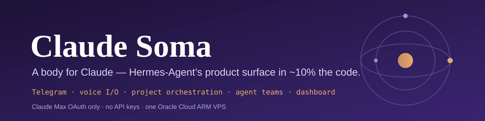
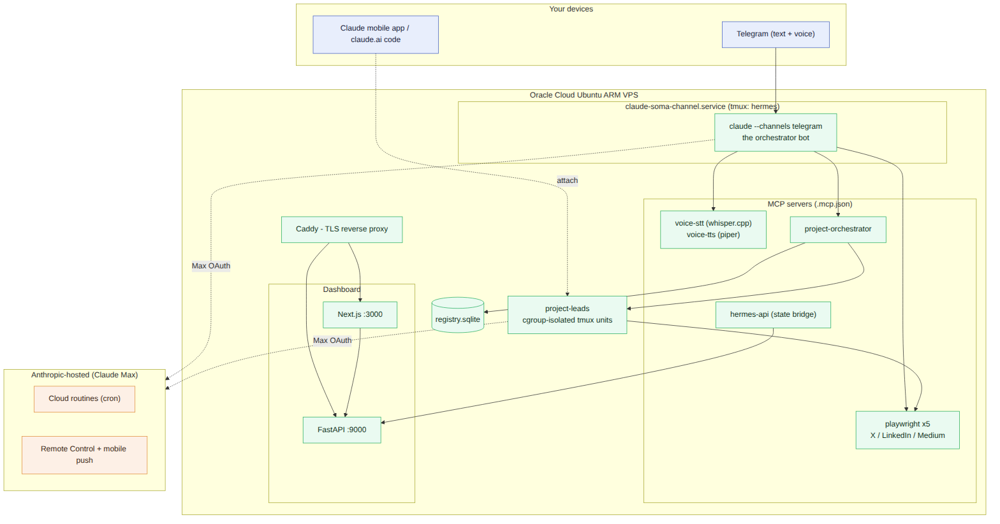
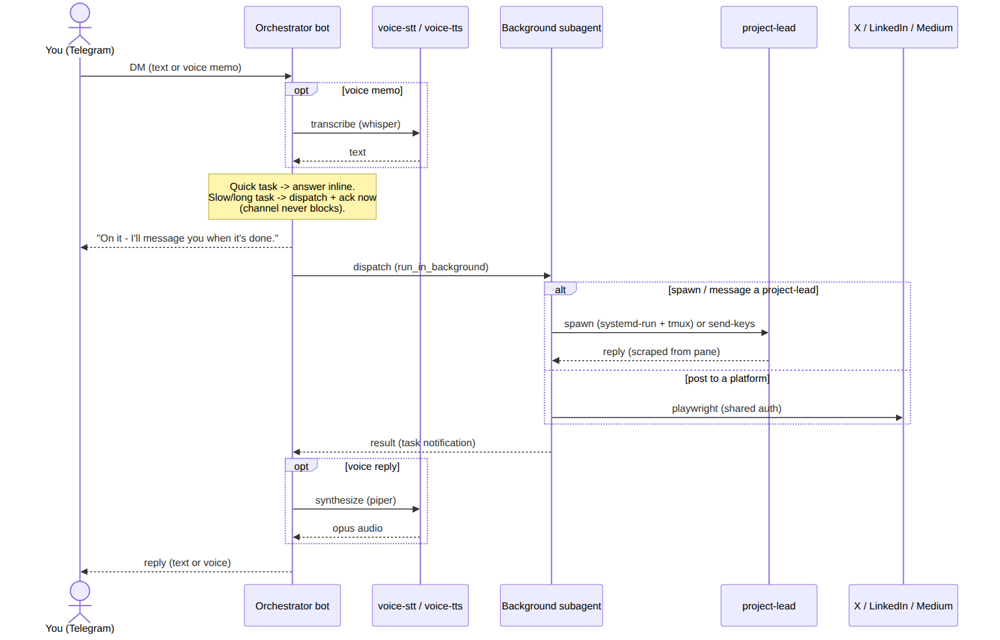
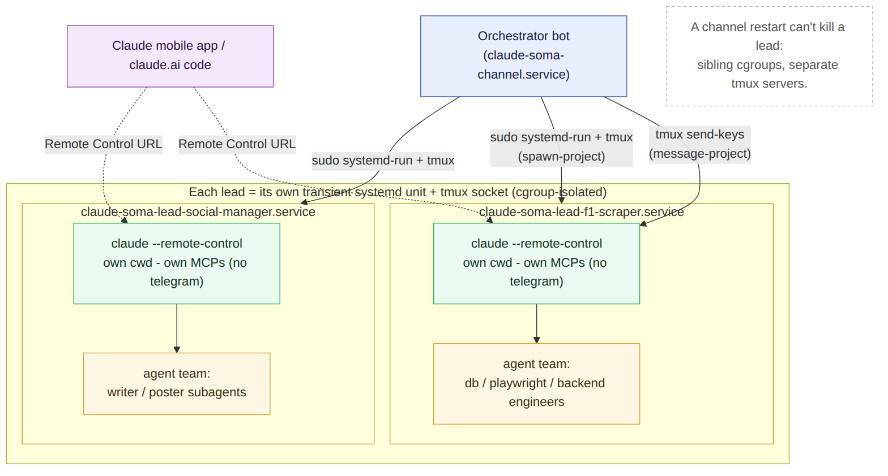

<p align="center">
  
</p>

<p align="center">
  <a href="LICENSE"></a>
  
  
  
</p>

<p align="center">
  <b><a href="https://soma.mayankgupta.in">soma.mayankgupta.in</a></b> &middot; by <a href="https://mayankgupta.in">Mayank Gupta</a>
</p>

---

**Claude Soma** (Greek *soma*, "body") gives Claude Code a body: a Telegram
channel, voice in and out, a project orchestrator that spawns persistent,
independent agent teams per workstream, social posting, and a showcase
dashboard. It is authed entirely through a **Claude Max subscription — no
Anthropic API keys** — and runs on a single Oracle Cloud Ubuntu ARM free-tier VPS.

## The thesis

[Hermes-Agent](https://github.com/NousResearch/hermes-agent) by Nous Research is
a ~27,000-line platform for self-improving messaging agents: channels, cron,
skills, memory curation, sandbox backends, trajectory tooling. After studying it,
the question this project answers is:

> What if your engine is Claude Code? How much do you actually need to build?

The answer is **a few thousand lines.** Channels (Telegram, Discord, custom),
agent teams, server-hosted scheduled routines, Remote Control, mobile push, MCP,
hooks, plugins, and auto-memory are all native to Claude Code if you know where
to look. The platform layer collapses; Claude Soma is the missing slice — a voice
pipeline, a project orchestrator, social posting, a dashboard, and curated
workflows — riding Claude Code's native rails.

## Features

- **Telegram channel** — DM the bot (text or voice); it replies in text or voice.
  The bot is an *orchestrator*: anything slow is dispatched to a background
  subagent and acked immediately, so your chat never blocks.
- **Voice in / out** — `voice-stt` (whisper.cpp) transcribes voice memos;
  `voice-tts` (piper -> opus) speaks replies.
- **Project orchestration** — spin up a persistent **project-lead** per
  workstream. Each lead is an independent Claude Code session in its own working
  directory, with its own Remote Control URL, that can run its own **agent team**.
- **cgroup-isolated leads** — every lead runs in its own transient `systemd` unit
  and tmux server, so a channel restart can't take it down.
- **Social posting** — per-platform Playwright MCP servers post to X, LinkedIn,
  and Medium using a shared, persistent browser-auth store (log in once via VNC,
  reused everywhere, refreshed weekly).
- **Scheduled routines** — server-hosted cron via Claude's cloud routines, plus
  `systemd` timers and crontab, all surfaced together.
- **Dashboard** — a FastAPI + Next.js admin/showcase site behind Caddy, gated by
  GitHub OAuth, reading live Claude state over a Unix-socket bridge.
- **Max OAuth only** — every Claude call draws on your Max plan; there is no
  Anthropic API key anywhere in the system.

## Architecture

The Telegram session is an **orchestrator**, not a team-lead. It spawns multiple
independent project-leads, each in its own cgroup, each able to run its own agent
team — sidestepping Claude Code's "one team per lead" constraint while giving you
per-project specialization.

<p align="center"></p>

A request flows in on Telegram (text or voice); fast work is answered inline,
slow work is dispatched to a background subagent so the channel stays responsive.
Messaging a project-lead is delivered by typing into its tmux pane and reading
the reply back from it — leads are independent processes, not chat teammates.

<p align="center"></p>

Each project-lead is spawned via `sudo systemd-run` into its own transient unit
and dedicated tmux socket, inherits all MCP servers **except** Telegram, and can
be attached to directly from the Claude mobile app or `claude.ai/code` via its
Remote Control URL. Three control surfaces, one Max account.

<p align="center"></p>

> Diagram sources (Mermaid) live next to the images in [`docs/images/`](docs/images/).
> Full design: [`docs/superpowers/specs/2026-05-22-hermes-claude-design.md`](docs/superpowers/specs/2026-05-22-hermes-claude-design.md).

## How you use it

| You say (Telegram) | Claude Soma does | You get |
|---|---|---|
| "What am I working on?" (voice) | `portfolio-status` skill | Voice/text reply listing repos + active project-leads |
| "Build a scraper for the F1 standings that tweets on change" | `spawn-project` -> orchestrator spawns a cgroup-isolated lead (`sudo systemd-run` + tmux) running its own agent team | A persistent `f1-scraper` lead with its own cwd, team, and Remote Control URL |
| "Tell f1-scraper to use httpx" | `message-project` -> `tmux send-keys` into the lead's pane; reply scraped back | The message delivered to the lead; its answer relayed to you |
| "Post this to LinkedIn" | a `playwright-linkedin` MCP session using the shared auth store | Posted, no per-task login |
| "Draw the system architecture" | `codex-image-gen` -> Codex CLI (your ChatGPT sub, not Max) | The image returned as a Telegram photo |
| "Every weekday 8am IST, send me a brief" | `schedule-routine` -> a cloud routine on Anthropic infra | Fires while you sleep; no local machine needed |

## Quickstart

On a fresh Ubuntu 24.04 VPS (2 GB+ RAM, public IPv4, DNS A-records configured):

```bash
sudo mkdir -p /opt/claude-soma && sudo chown ubuntu:ubuntu /opt/claude-soma
cd /opt/claude-soma
git clone https://github.com/techfreakworm/claude-soma.git .
sudo bash scripts/bootstrap.sh --cloud=oci  # or omit --cloud=oci on non-OCI; ends with DNS records you must add at your DNS provider
sudo cp secrets.env.example /etc/claude-soma/secrets.env
sudo nano /etc/claude-soma/secrets.env  # fill in the required keys
sudo bash scripts/smoke_install.sh       # verify
```

For the full install runbook with prerequisites, external CLI setup, and troubleshooting: see [INSTALL.md](INSTALL.md).

## Configuration

- **Auth:** Claude Max OAuth only. The token lives in
  `/etc/claude-soma/secrets.env` as `CLAUDE_CODE_OAUTH_TOKEN`; nothing reads an
  Anthropic API key.
- **Channel:** the bot runs ONE messaging channel — **Telegram or Discord** —
  chosen via `SOMA_ACTIVE_CHANNEL` in `secrets.env`. It opts into only that
  channel's plugin via `config/claude/channel-settings.<channel>.json` (so the
  channel never leaks into project-leads). Switch channels by editing
  `SOMA_ACTIVE_CHANNEL` and restarting `claude-soma-channel.service`.
- **Social auth:** run `node scripts/pw-login.js` once on the VNC desktop to log
  into X / LinkedIn / Medium; `pw-refresh` keeps the sessions warm.
- **Sessions:** `somux ls | a <name> | peek <name>` lists/attaches/peeks the
  channel + every project-lead (each on its own tmux socket).

### Forking — replace the author's personal defaults

Shipped install artifacts (Caddyfile, `caddy/files.caddyfile`, the API CORS
fallback, the frontend metadata, the engagement-drip URL template, the channel
bot's system prompt) all read their domain from envs in
`/etc/claude-soma/secrets.env`. To stand up your own instance, set these
keys in that file:

```
SOMA_DOMAIN=example.com            # base domain — dashboard goes on soma.<this>
FILES_DOMAIN=files.example.com     # optional override; defaults to files.<SOMA_DOMAIN>
ACME_EMAIL=you@example.com         # Let's Encrypt registration email
HERMES_ALLOWED_GITHUB_HANDLES=your-github-username
```

`scripts/finalize-caddy.sh` renders the Caddyfile + site configs from those
values. The frontend reads `NEXT_PUBLIC_SITE_URL`, `NEXT_PUBLIC_AUTHOR_NAME`,
and `NEXT_PUBLIC_AUTHOR_URL` at build time for footer attribution + OpenGraph
metadata. The `.claude-plugin/*.json` files are plugin marketplace metadata —
keep the original author there unless you're publishing a fork to your own
plugin marketplace. The `docs/superpowers/` specs are frozen historical
artifacts — leave them as-is.

## Project layout

```
claude-soma/
  .claude-plugin/        Claude Code plugin + marketplace metadata
  .mcp.json              wires the MCP servers into the bot
  config/claude/         channel-settings.<telegram|discord>.json (per-channel opt-in), lead-mcp.json
  src/claude_soma/
    mcp_servers/
      voice_stt/         whisper.cpp wrapper
      voice_tts/         piper + ffmpeg -> opus
      project_orchestrator/   registry + spawner + templates + server
      hermes_api/        Unix-socket state bridge for the dashboard
    api/                 FastAPI dashboard backend (routes/, auth, SSE)
    wizard/              interactive setup wizard
  frontend/              Next.js dashboard (standalone build)
  skills/                11 Claude Code skills (spawn/message/kill/list project,
                         schedule-routine, portfolio-status, voice, codex-image-gen, ...)
  agents/                subagent template(s) for spawned leads
  templates/projects/    project-type templates (web-scraper, llm-app, ...)
  hooks/                 Stop + SessionStart + UserPromptSubmit + PreToolUse + PostToolUse hooks
  scripts/               deploy, bootstrap, healthcheck, voice intake, somux,
                         pw-login / pw-refresh, ...
  systemd/               channel, api, frontend, timers (healthcheck, reaper, ...)
  tests/                 pytest suite across the MCP servers + API
  docs/                  design spec + plan, images, engineering notes
```

## Status

A personal-use-first build, deployed and actively developed on a single OCI ARM
VPS, on its way to a polished portfolio showcase. The Telegram orchestrator,
cgroup-isolated project-lead spawning, the MCP toolset, and the dashboard are in
place; the voice and social-posting pipelines are wired and in bring-up. Docs
that lag the code are noted as such — trust the code and `git log`.

## Contributing

Issues and PRs welcome. Repo conventions live in
[`CLAUDE.md`](CLAUDE.md): Python 3.12, `ruff` (line length 100), `mypy --strict`,
`pytest` (`asyncio_mode = "auto"`); conventional-style commit subjects; no emoji
in code or commits. Run the suite with `pytest -v` (voice tests skip without
whisper/piper installed).

## License

[MIT](LICENSE) (c) Mayank Gupta.

## Acknowledgements

- [Hermes-Agent](https://github.com/NousResearch/hermes-agent) (Nous Research) —
  the platform whose product surface this project distills onto Claude Code.
- [Anthropic Claude Code](https://docs.claude.com/en/docs/claude-code) — the
  engine: channels, agent teams, Remote Control, MCP, hooks, routines.
- whisper.cpp, piper, Playwright, Caddy, FastAPI, and Next.js.
